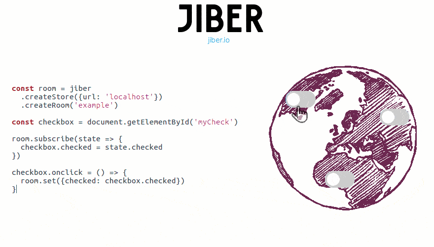

[](https://jiber.io)


HiDB is an open source API for realtime web apps. It sets up peer-to-peer connections via webRTC, and backs that up with a more reliable client/server WebSocket connection.

- **Fast**: Updates are sent peer to peer to minimize latency.
- **Light**: hidb-client is 3kb, and has no dependencies.
- **Offline-First**: User actions are applied optimistically until a connection becomes available.

### Live Demos
  - [Global Switch](https://codepen.io/jacob-grahn/pen/BmqzpR)
  - [Draw with Friends](https://codepen.io/jacob-grahn/pen/mqGmWb)

### Server Installation
```
npm i hidb-server
```

### Client Installation
```
npm i hidb-client
```

### Documentation
- [Get Started with hidb-server](/packages/hidb-server)
- [Get Started with hidb-client](/packages/hidb-client)
- See HiDB's Docs at [docs.hidb.io](http://docs.hidb.io)

### Examples
Examples can be found in [/examples](/examples).

### Contributing
See [CONTRIBUTING.md](/CONTRIBUTING.md)

### License
MIT
